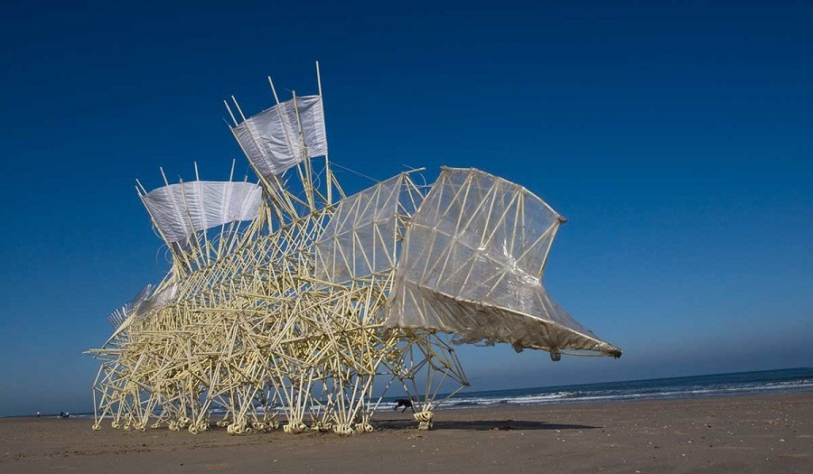

# Dynamic and kinematic analysis of the strandbeest 

Kinematic and dynamic modelling of a special kind of strandbeest able to carry a load on top (see below) - MATLAB. We developed a 2D model of a dynamical system (strandbeest). Our program gives us position, speed, accelerations, forces and moments for each component of our mechanism (at joints) when a driving external actuator forces the mechanism to move (In real life : the wind). An animation of the mechanism in motion and with force measurement at each joint can be ran with MAINDYN.m inside Dynamics Project folder.

## Real life strandbeest

## Our model

